# ERP Diagrams And Reconciliation Strategy

This document is a code-level map of the current ERP system. It covers the active order, stock, dispatch, delivery, settlement, dues, reports, dashboard, and frontend data flows, plus the legacy or disconnected sales, purchases, and delivery-summary surfaces.

## 1. Complete ERD

```mermaid
erDiagram
  USERS {
    uuid id PK
    string email UK
    string username UK
    string name
    string role
    string status
    string allowedRouteIds
  }

  COMPANIES {
    int id PK
    string name
    string code UK
    string address
    string phone
    boolean isActive
  }

  ROUTES {
    int id PK
    string name UK
    string area
    boolean isActive
  }

  SHOPS {
    int id PK
    int routeId FK
    string name
    string ownerName
    string phone
    string address
    boolean isActive
    uuid createdById
    int companyId "used in code, not mapped as Column"
  }

  PRODUCTS {
    int id PK
    int companyId FK
    string name
    string sku
    string unit
    decimal buyPrice
    decimal salePrice
    decimal currentStock
    boolean isActive
  }

  ORDERS {
    int id PK
    date orderDate
    int companyId FK
    int routeId FK
    int deliveryPersonId FK
    uuid assignedDeliveryManId FK
    int shopId FK
    decimal subtotal
    decimal discountAmount
    string discountType
    decimal discountValue
    decimal grandTotal
    decimal advancePaid
    decimal actualSoldAmount
    decimal collectedAmount
    decimal dueAmount
    string status
    timestamp dispatchedAt
    timestamp deliveredAt
    timestamp settledAt
    boolean isLocked
    uuid createdById
    string createdByRole
  }

  ORDER_ITEMS {
    int id PK
    int orderId FK
    int productId FK
    decimal quantity
    decimal freeQuantity
    decimal unitPrice
    decimal discountAmount
    string discountType
    decimal discountValue
    decimal lineTotal
    decimal deliveredQuantity
    decimal returnedQuantity
    decimal damagedQuantity
  }

  STOCK_MOVEMENTS {
    int id PK
    int productId FK
    int companyId FK
    string type
    decimal quantity
    string note
    string reference
    string user
    timestamp createdAt
  }

  DELIVERY_PEOPLE {
    int id PK
    uuid userId
    string name
    string phone
    string email
    string vehicleNo
    boolean isActive
  }

  DISPATCH_BATCHES {
    int id PK
    string batchNo UK
    date dispatchDate
    int companyId FK
    int routeId FK
    int deliveryPersonId FK
    uuid assignedDeliveryManId FK
    string status
    int totalOrders
    decimal grossDispatchedValue
    decimal finalSoldValue
    decimal totalAdvancePaid
    decimal totalCollectedAmount
    decimal totalDueAmount
    decimal shortageOrExcess
    boolean isMorningPrinted
    boolean isFinalPrinted
    timestamp dispatchedAt
    timestamp settledAt
  }

  DISPATCH_BATCH_ORDERS {
    int id PK
    int batchId FK
    int orderId FK
    decimal estimatedAmount
    decimal finalSoldAmount
    decimal collectedAmount
    decimal dueAmount
    decimal shortageOrExcess
    boolean isSettled
    string deliveryStatus
    timestamp deliveryCompletedAt
  }

  DISPATCH_BATCH_ITEMS {
    int id PK
    int batchId FK
    int productId FK
    decimal totalDispatchedQty
    decimal totalReturnedQty
    decimal totalDamagedQty
    decimal totalDeliveredQty
    decimal estimatedAmount
    decimal finalSoldAmount
  }

  DELIVERY_RETURNS {
    int id PK
    int batchId FK
    int batchOrderId FK
    string returnReason
  }

  DELIVERY_RETURN_ITEMS {
    int id PK
    int deliveryReturnId FK
    int productId FK
    decimal dispatchedQuantity
    decimal returnedQuantity
    decimal paidReturnedQuantity
    decimal freeReturnedQuantity
    decimal damagedQuantity
    decimal deliveredQuantity
  }

  DAMAGE_RECORDS {
    int id PK
    int batchId FK
    int orderId FK
    int productId FK
    decimal quantity
    string reason
  }

  CASH_COLLECTIONS {
    int id PK
    int batchId FK
    int batchOrderId FK
    decimal amount
    string paymentMode
    string status
  }

  DUES {
    int id PK
    int orderId FK_UK
    int shopId FK
    int routeId FK
    string srId
    string srName
    decimal dueAmount
    decimal paidAmount
    decimal remainingDue
    string status
  }

  DUE_COLLECTIONS {
    int id PK
    int dueId FK
    int orderId FK
    int shopId FK
    int routeId FK
    string srId
    string srName
    decimal collectedAmount
    date collectionDate
    string status
    string approvedBy
    timestamp approvedAt
  }

  DELIVERY_SUMMARIES {
    int id PK
    date deliveryDate
    int companyId FK
    int routeId FK
    string status
    boolean morningPrinted
    boolean finalPrinted
    decimal totalAmount
  }

  DELIVERY_SUMMARY_ITEMS {
    int id PK
    int summaryId FK
    int productId FK
    decimal orderedQuantity
    decimal returnedQuantity
    decimal soldQuantity
    decimal unitPrice
    decimal lineTotal
  }

  PURCHASES {
    int id PK
    date purchaseDate
    string invoiceNo UK
    int companyId FK
    string supplierName
    decimal totalAmount
    decimal paidAmount
    decimal dueAmount
    string status
  }

  PURCHASE_ITEMS {
    int id PK
    int purchaseId FK
    int productId FK
    decimal quantity
    decimal unitCost
    decimal lineTotal
  }

  COMPANIES ||--o{ PRODUCTS : owns
  COMPANIES ||--o{ ORDERS : receives
  COMPANIES ||--o{ STOCK_MOVEMENTS : scopes
  COMPANIES ||--o{ DISPATCH_BATCHES : scopes
  COMPANIES ||--o{ DELIVERY_SUMMARIES : legacy_scope
  COMPANIES ||--o{ PURCHASES : inactive_scope

  ROUTES ||--o{ SHOPS : contains
  ROUTES ||--o{ ORDERS : route
  ROUTES ||--o{ DISPATCH_BATCHES : route
  ROUTES ||--o{ DUES : route
  ROUTES ||--o{ DUE_COLLECTIONS : route
  ROUTES ||--o{ DELIVERY_SUMMARIES : legacy_route

  SHOPS ||--o{ ORDERS : customer
  SHOPS ||--o{ DUES : owes
  SHOPS ||--o{ DUE_COLLECTIONS : pays

  PRODUCTS ||--o{ ORDER_ITEMS : sold
  PRODUCTS ||--o{ STOCK_MOVEMENTS : moves
  PRODUCTS ||--o{ DISPATCH_BATCH_ITEMS : summarized
  PRODUCTS ||--o{ DELIVERY_RETURN_ITEMS : returned
  PRODUCTS ||--o{ DAMAGE_RECORDS : damaged
  PRODUCTS ||--o{ DELIVERY_SUMMARY_ITEMS : legacy_summary
  PRODUCTS ||--o{ PURCHASE_ITEMS : inactive_purchase

  USERS ||--o{ ORDERS : assignedDeliveryMan
  USERS ||--o{ DISPATCH_BATCHES : assignedDeliveryMan
  DELIVERY_PEOPLE ||--o{ ORDERS : deliveryPerson
  DELIVERY_PEOPLE ||--o{ DISPATCH_BATCHES : deliveryPerson

  ORDERS ||--o{ ORDER_ITEMS : items
  ORDERS ||--o{ DISPATCH_BATCH_ORDERS : batched
  ORDERS ||--o| DUES : due
  ORDERS ||--o{ DUE_COLLECTIONS : dueCollections
  ORDERS ||--o{ DAMAGE_RECORDS : damages

  DISPATCH_BATCHES ||--o{ DISPATCH_BATCH_ORDERS : orders
  DISPATCH_BATCHES ||--o{ DISPATCH_BATCH_ITEMS : items
  DISPATCH_BATCHES ||--o{ DELIVERY_RETURNS : returns
  DISPATCH_BATCHES ||--o{ CASH_COLLECTIONS : cash
  DISPATCH_BATCHES ||--o{ DAMAGE_RECORDS : damages

  DISPATCH_BATCH_ORDERS ||--o{ DELIVERY_RETURNS : returns
  DISPATCH_BATCH_ORDERS ||--o{ CASH_COLLECTIONS : collections
  DELIVERY_RETURNS ||--o{ DELIVERY_RETURN_ITEMS : items
  DUES ||--o{ DUE_COLLECTIONS : collections

  DELIVERY_SUMMARIES ||--o{ DELIVERY_SUMMARY_ITEMS : legacy_items
  PURCHASES ||--o{ PURCHASE_ITEMS : inactive_items
```

Notes:

- `sales` entities are deprecated stubs and do not form a real ERD.
- `purchases` entities exist but the module is not imported in `AppModule`, so purchase APIs are inactive.
- `delivery_summaries` is legacy-style and overlaps with delivery ops.
- `shops.companyId` is used by service code but is not decorated with `@Column`, so the ORM does not reliably persist it.

## 2. Request Lifecycle Map

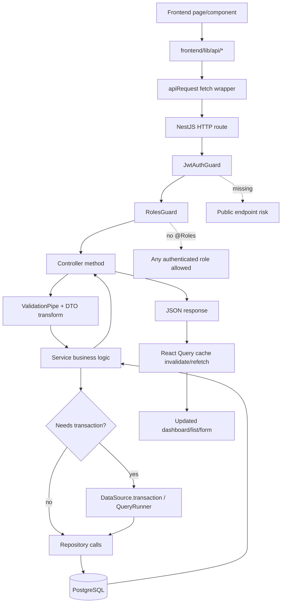

Typical authenticated request:

1. UI calls a typed function in `frontend/lib/api`.
2. `apiRequest` sends JWT bearer token.
3. Backend guard validates JWT.
4. Roles guard checks route roles if `@Roles` exists.
5. DTO validation strips unknown fields and transforms types.
6. Service executes business rules and database operations.
7. Frontend invalidates related React Query keys.

## 3. Order Lifecycle Map

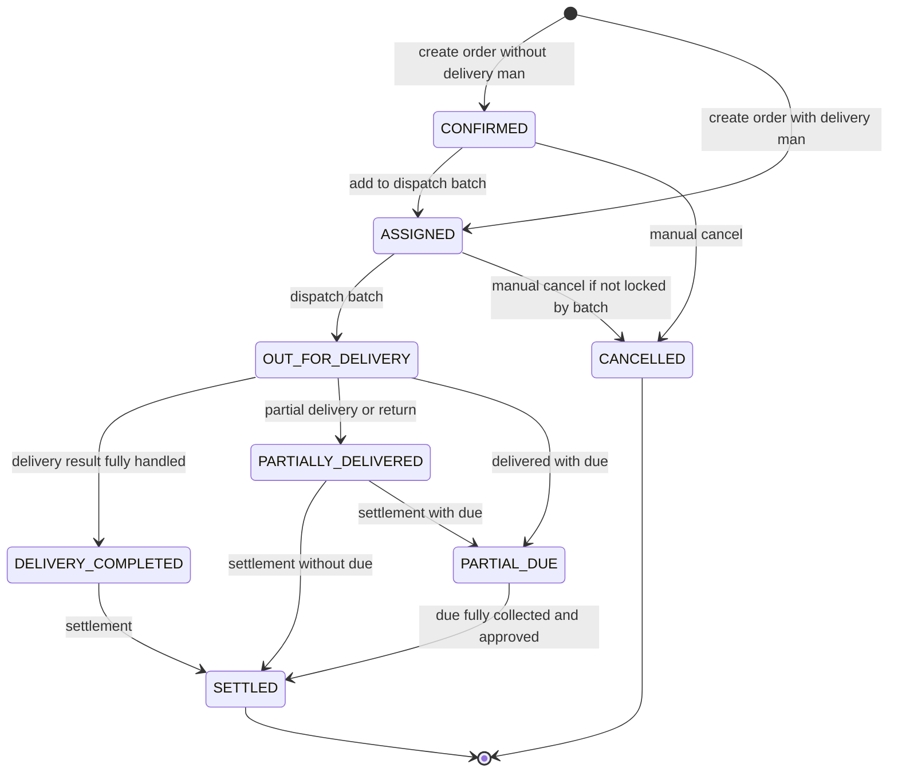

Important implementation detail: `DELIVERED`, `RETURNED_PARTIAL`, and `DRAFT` exist in the enum but are not consistently used by the main delivery-ops path.

## 4. Stock Flow Diagram

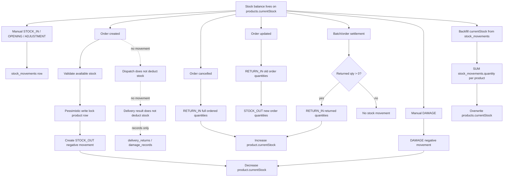

Stock source-of-truth reality:

- Operational balance is `products.currentStock`.
- Ledger history is `stock_movements`.
- Core order creation keeps both in sync.
- Legacy delivery summaries and duplicate settlement can break sync.

## 5. Settlement Calculation Flowchart

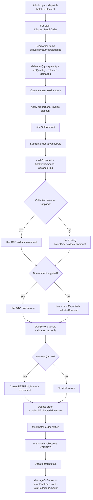

Accounting risk:

- Supplied due amount is not required to equal `finalSoldAmount - advancePaid - collectedAmount`.
- `actualCashReceived` only affects shortage/excess. It does not rebalance order dues or collections.
- There is no double-entry accounting ledger.

## 6. Module Dependency Map

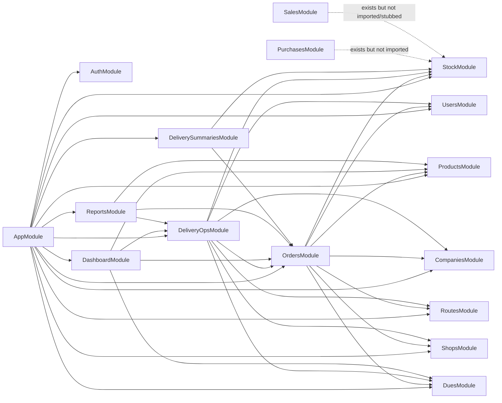

## 7. API Dependency Chain

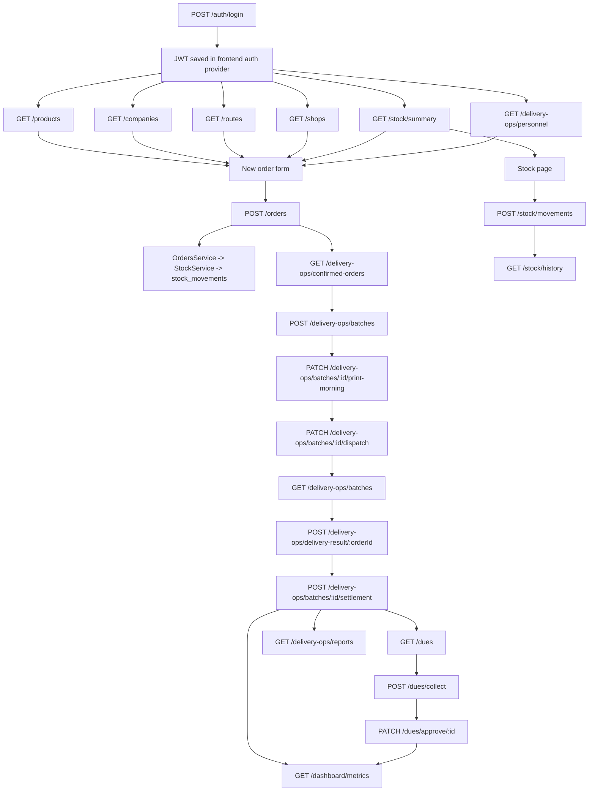

Risky or inactive chains:

```mermaid
flowchart TD
  SalesPages[Frontend /sales pages] -. call .-> SalesApi[/sales/*]
  SalesApi -. backend inactive/stubbed .-> BrokenSales[Disconnected]

  PurchasePages[Frontend /purchases pages] -. call .-> PurchaseApi[/purchases/*]
  PurchaseApi -. module not imported .-> BrokenPurchases[Unreachable]

  DeliverySummaryPages[Frontend /delivery-summaries pages] --> DeliverySummaryApi[/delivery-summaries/*]
  DeliverySummaryApi -. no guards .-> PublicRisk[Public legacy API risk]
```

## 8. Frontend-To-Backend Data Flow

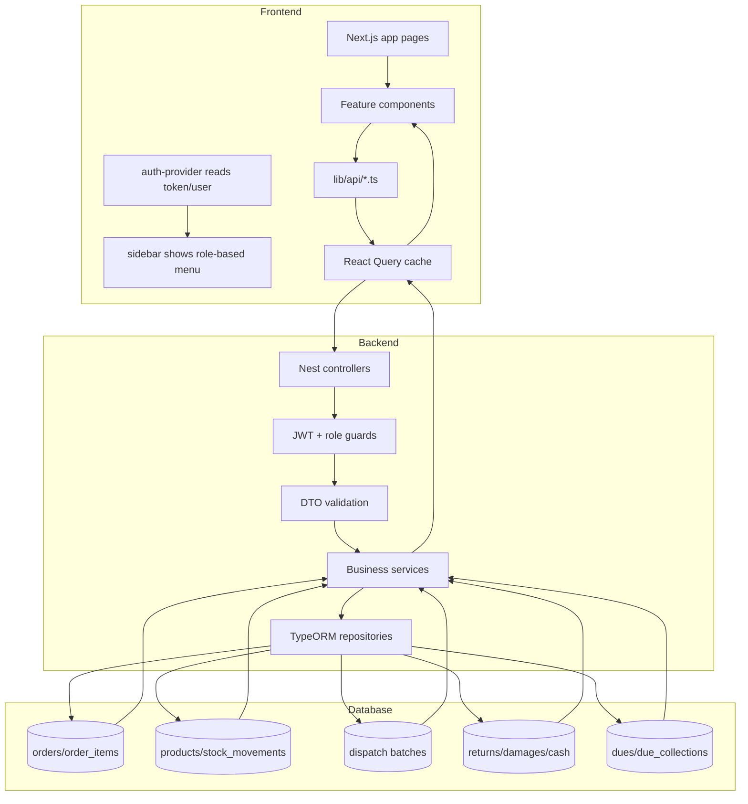

Frontend areas that align well with active backend:

- Orders
- Stock
- Delivery operations
- Dues
- Dashboard
- Free quantity report

Frontend areas that do not align well:

- Sales pages call inactive or stubbed APIs.
- Purchase pages call an unregistered backend module.
- Delivery summaries call an unguarded legacy controller.
- Dashboard expects some fields the backend does not return.

## 9. Possible Data Corruption Scenarios

| Scenario | Where it happens | Why it can corrupt data | Expected symptom |
|---|---|---|---|
| Duplicate settlement request | `POST /delivery-ops/batches/:id/settlement` | No idempotency key or row lock before returning stock | Returned stock added twice, order/batch totals duplicated or overwritten |
| Legacy delivery summary return failure | `PATCH /delivery-summaries/:id/returns` | Stock movement uses separate transaction inside outer transaction | Stock returned even if summary update fails |
| Due over-collection | `POST /dues/collect` | Pending collections checked outside transaction/lock | Multiple pending collections exceed remaining due |
| Same order in two active batches | `POST /delivery-ops/batches` | Active batch check has no DB-level unique constraint or order row lock | One order assigned to multiple batches |
| Negative order quantities | `POST /orders` | DTOs lack strong min validation | Negative STOCK_OUT may increase stock incorrectly |
| Negative settlement collection | `POST /delivery-ops/batches/:id/settlement` | DTO does not fully block negative money values | Due/cash totals become mathematically invalid |
| Shop-company mismatch | Shop creation/linking | `Shop.companyId` is not mapped as a column | Due/order can be linked to shop from wrong company |
| Deleting referenced data | Product/shop/user/order deletes | Missing protective app checks in several services | Orphan records or DB FK errors |
| Manual stock backfill during live sales | `POST /stock/backfill` | Recomputes stock without global lock | Current stock can be overwritten mid-movement |
| Dashboard mismatch | Dashboard service | Dashboard uses selected statuses and live calculations | Dashboard totals differ from settlement/raw DB totals |
| Damage not represented in stock ledger | Delivery result / settlement | Damage record saved but no stock movement for delivery damage | Stock ledger cannot explain damaged loss |
| Fast-track partial failure | Frontend fast-track flow | Creates orders then creates batch via separate requests | Stock deducted but batch creation fails |

## 10. Stock Recovery And Reconciliation Strategy

### Immediate incident process

1. Pause order creation, dispatch, delivery result, settlement, manual stock movements, and backfill.
2. Take a database backup.
3. Export these tables: `products`, `stock_movements`, `orders`, `order_items`, `dispatch_batches`, `dispatch_batch_orders`, `delivery_returns`, `delivery_return_items`, `damage_records`.
4. Identify affected date range and products.
5. Reconcile ledger stock against cached stock.

### Stock reconciliation formula

Preferred ledger balance:

```text
ledgerStock(productId) = SUM(stock_movements.quantity WHERE productId = product.id)
```

Cached balance:

```text
cachedStock(productId) = products.currentStock
```

Mismatch:

```text
stockMismatch = cachedStock - ledgerStock
```

If `stockMismatch != 0`, investigate:

- Duplicate settlement return movements.
- Missing order `STOCK_OUT` movements.
- Manual adjustment errors.
- Legacy delivery summary return movements.
- Backfill run during live activity.

### Stock reconciliation query ideas

```sql
-- Product cache vs movement ledger
SELECT
  p.id,
  p.name,
  p."currentStock" AS cached_stock,
  COALESCE(SUM(sm.quantity), 0) AS ledger_stock,
  p."currentStock" - COALESCE(SUM(sm.quantity), 0) AS mismatch
FROM products p
LEFT JOIN stock_movements sm ON sm."productId" = p.id
GROUP BY p.id, p.name, p."currentStock"
HAVING p."currentStock" <> COALESCE(SUM(sm.quantity), 0);
```

```sql
-- Suspicious duplicate return references
SELECT reference, "productId", type, COUNT(*) AS movement_count, SUM(quantity) AS total_quantity
FROM stock_movements
WHERE type = 'RETURN_IN'
GROUP BY reference, "productId", type
HAVING COUNT(*) > 1;
```

```sql
-- Orders without expected order stock-out reference
SELECT o.id
FROM orders o
LEFT JOIN stock_movements sm ON sm.reference = CONCAT('Order #', o.id)
WHERE o.status <> 'CANCELLED'
GROUP BY o.id
HAVING COUNT(sm.id) = 0;
```

### Safe stock correction

Do not directly edit `products.currentStock` as a normal fix. Prefer an auditable movement:

```text
correctionQty = ledgerExpectedStock - currentStock
create ADJUSTMENT stock movement with correctionQty
update products.currentStock through StockService
note = "Reconciliation correction: incident/date/reference"
```

Only use direct product stock edits for emergency repair after a backup and written approval.

## 11. Settlement Recovery And Reconciliation Strategy

### Settlement invariants

For each settled or partially due order:

```text
expectedDue = actualSoldAmount - advancePaid - collectedAmount
```

Expected:

```text
dueAmount == max(0, expectedDue)
```

For each due record:

```text
remainingDue = dueAmount - paidAmount
```

For each batch:

```text
batch.finalSoldValue == SUM(dispatch_batch_orders.finalSoldAmount)
batch.totalCollectedAmount == SUM(dispatch_batch_orders.collectedAmount)
batch.totalDueAmount == SUM(dispatch_batch_orders.dueAmount)
batch.totalAdvancePaid == SUM(orders.advancePaid for batch orders)
```

Cash settlement check:

```text
shortageOrExcess = actualCashReceived - totalCollectedAmount
```

This value should be stored with the actual cash receipt source; currently only the derived batch value remains.

### Settlement reconciliation query ideas

```sql
-- Order-level cash/due mismatch
SELECT
  id,
  "actualSoldAmount",
  "advancePaid",
  "collectedAmount",
  "dueAmount",
  "actualSoldAmount" - "advancePaid" - "collectedAmount" AS expected_due
FROM orders
WHERE status IN ('SETTLED', 'PARTIAL_DUE')
  AND ABS("dueAmount" - GREATEST(0, "actualSoldAmount" - "advancePaid" - "collectedAmount")) > 0.01;
```

```sql
-- Due balance mismatch
SELECT
  id,
  "orderId",
  "dueAmount",
  "paidAmount",
  "remainingDue",
  "dueAmount" - "paidAmount" AS expected_remaining
FROM dues
WHERE ABS("remainingDue" - ("dueAmount" - "paidAmount")) > 0.01;
```

```sql
-- Batch totals vs child rows
SELECT
  b.id,
  b."batchNo",
  b."finalSoldValue",
  SUM(bo."finalSoldAmount") AS child_final,
  b."totalCollectedAmount",
  SUM(bo."collectedAmount") AS child_collected,
  b."totalDueAmount",
  SUM(bo."dueAmount") AS child_due
FROM dispatch_batches b
JOIN dispatch_batch_orders bo ON bo."batchId" = b.id
GROUP BY b.id, b."batchNo", b."finalSoldValue", b."totalCollectedAmount", b."totalDueAmount"
HAVING
  ABS(b."finalSoldValue" - SUM(bo."finalSoldAmount")) > 0.01
  OR ABS(b."totalCollectedAmount" - SUM(bo."collectedAmount")) > 0.01
  OR ABS(b."totalDueAmount" - SUM(bo."dueAmount")) > 0.01;
```

```sql
-- Due record not aligned with order
SELECT
  d.id,
  d."orderId",
  d."dueAmount" AS due_record_amount,
  o."dueAmount" AS order_due_amount,
  d."remainingDue"
FROM dues d
JOIN orders o ON o.id = d."orderId"
WHERE ABS(d."dueAmount" - o."dueAmount") > 0.01;
```

### Safe settlement correction

1. Freeze the affected batch/order.
2. Recalculate order items from delivered/returned/damaged quantities.
3. Recompute `actualSoldAmount`, `collectedAmount`, and `dueAmount`.
4. Recompute or recreate the `Due` row.
5. Recompute batch child totals.
6. Recompute parent batch totals from child rows.
7. Record the correction in an audit log or manual correction note.
8. If stock was returned twice, create a reversing `ADJUSTMENT` movement.

## 12. Hardening Plan To Prevent Future Corruption

### Database constraints

- Add unique partial constraint so an unsettled order can be in only one active dispatch batch.
- Add non-negative check constraints for quantities and money fields.
- Add FK constraints where missing.
- Add indexes for order status/date/company/route, batch status/date/route/delivery man, stock movement product/date, dues status/shop/route.
- Add a real `shops.companyId` column or remove company validation from shops and derive company elsewhere.

### Transaction and locking improvements

- Lock order rows during update, cancel, delivery result, and settlement.
- Lock dispatch batch rows during settlement.
- Lock due rows during due collection request.
- Add idempotency keys to order create, delivery result, and settlement.
- Make delivery summary stock changes use the same transaction manager or retire the module.

### Accounting improvements

- Add immutable accounting ledger entries:
  - sale revenue
  - discount
  - cash received
  - due receivable
  - return reversal
  - damage/loss
  - expense
  - settlement shortage/excess
- Make settlement post ledger entries atomically with order/batch status updates.
- Store actual cash received per settlement, not only derived shortage/excess.

### Stock improvements

- Treat stock movements as the source of truth.
- Keep product current stock as a cached balance updated only through stock service.
- Add stock reconciliation report.
- Record delivery damages as `DAMAGE` stock movements at settlement.
- Prevent manual backfill while stock-affecting operations are live.

### Reporting improvements

- Add daily snapshots for dashboard metrics.
- Build reports from ledger/snapshot tables instead of mutable operational rows.
- Add report definitions for sales, stock valuation, due aging, damage/loss, route performance, delivery man performance, cash reconciliation, and settlement history.

## 13. CI/CD Deployment Architecture

Current deployment shape:

- Backend: NestJS app with `npm run build` and `npm run start:prod`.
- Frontend: Next.js app with `npm run build` and `npm run start`.
- Database: PostgreSQL through `DATABASE_URL`; the example URL uses a hosted Postgres pooler.
- Existing deploy metadata: `backend/vercel.json` and `frontend/vercel.json`.
- Missing: CI workflow, migration runner, release gates, environment promotion, rollback automation, performance gates.

Recommended CI/CD flow:

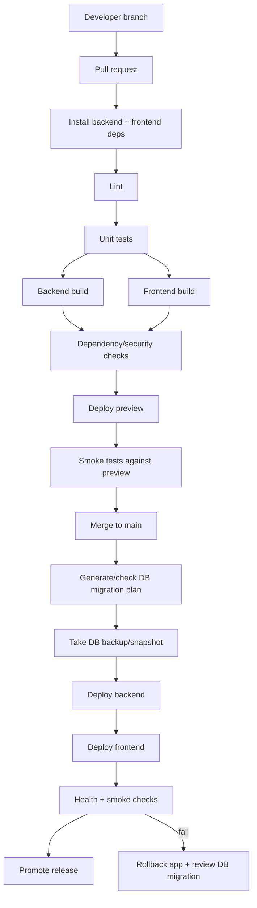

Recommended environments:

| Environment | Purpose | Database | Deploy trigger |
|---|---|---|---|
| Local | Developer testing | Local/Postgres branch | Manual |
| Preview | PR validation | Ephemeral/branch DB | Pull request |
| Staging | Production-like validation | Staging DB copy/anonymized | Main branch |
| Production | Live ERP | Production DB with PITR | Tagged release/manual approval |

Recommended release gates:

- Backend build must pass.
- Frontend build must pass.
- Unit/integration tests must pass.
- Migration dry-run must pass.
- Smoke tests for login, dashboard, order create, stock movement, dispatch batch, delivery result, settlement.
- No destructive migration without manual approval.
- No production deploy if `DB_SYNCHRONIZE=true` or `DB_DROP_SCHEMA=true`.

Minimal GitHub Actions shape:

```yaml
name: ci

on:
  pull_request:
  push:
    branches: [main]

jobs:
  build-test:
    runs-on: ubuntu-latest
    steps:
      - uses: actions/checkout@v4
      - uses: actions/setup-node@v4
        with:
          node-version: 22
          cache: npm
      - name: Backend install
        working-directory: backend
        run: npm ci
      - name: Backend build
        working-directory: backend
        run: npm run build
      - name: Backend tests
        working-directory: backend
        run: npm test -- --runInBand
      - name: Frontend install
        working-directory: frontend
        run: npm ci
      - name: Frontend build
        working-directory: frontend
        run: npm run build
```

Production deployment recommendation:

- Keep frontend on Vercel or any static/Next-capable platform.
- Prefer backend on a long-running Node container/VM for predictable DB connection pooling, background jobs, and profiling.
- If backend remains serverless, use a Postgres pooler, very small TypeORM pool, no long transactions, and move background jobs out of request handlers.

## 14. Backup And Disaster Recovery Plan

Recovery objectives:

| Layer | Target RPO | Target RTO | Notes |
|---|---:|---:|---|
| Database | 5-15 minutes | 30-120 minutes | Depends on hosted Postgres PITR/snapshots |
| Uploaded files | 15 minutes | 1-4 hours | No upload subsystem currently visible |
| Application code | Near zero | 15-30 minutes | Git + deployment rollback |
| Config/secrets | 1 hour | 1-2 hours | Needs secret manager/export procedure |

Backup schedule:

- Continuous PITR for production PostgreSQL.
- Daily logical `pg_dump` retained for 30 days.
- Weekly full snapshot retained for 12 weeks.
- Monthly archive retained for 12 months.
- Pre-deploy snapshot before migrations.
- Manual snapshot before bulk reconciliation or backfill.

Backup contents:

- Full database.
- Environment variable inventory, without exposing secrets in Git.
- Deployment artifact/version SHA.
- Migration files and release notes.
- Reconciliation exports for `products`, `stock_movements`, `orders`, `order_items`, `dispatch_batches`, `dispatch_batch_orders`, `dues`, `due_collections`.

Disaster recovery runbook:

1. Declare incident and freeze writes if data corruption is suspected.
2. Identify last known good timestamp.
3. Restore production backup/PITR to a separate recovery database.
4. Run stock and settlement reconciliation queries against live and recovery databases.
5. Choose repair path:
   - Full restore if most data is corrupt.
   - Selective correction if only stock/settlement rows are affected.
6. Point staging app at recovery database and run smoke tests.
7. Promote recovered database or apply correction migrations.
8. Re-enable writes.
9. Produce incident report with root cause and preventive fix.

Backup validation:

- Restore one backup weekly to a disposable database.
- Run backend smoke tests against restored DB.
- Verify dashboard loads.
- Verify stock reconciliation query returns expected results.
- Verify settlement reconciliation query returns expected results.

## 15. Server Scaling Strategy

Current bottleneck risk:

- Backend is stateless enough to scale horizontally.
- Database is the central bottleneck.
- Stock deduction uses product row locks, so hot products serialize order creation.
- Dashboard/report endpoints currently read large joined datasets and aggregate in Node memory.
- No queue/worker/cache layer exists.

Recommended target architecture:

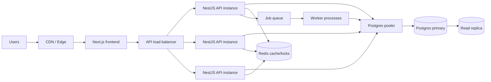

Scaling phases:

| Phase | Trigger | Action |
|---|---|---|
| 1 | Small team/live use | One backend, one DB, strict indexes, pagination |
| 2 | Slow dashboards/reports | Add SQL aggregation, indexes, query pagination |
| 3 | Many users/orders | Horizontal API instances + DB pooler |
| 4 | Heavy dashboard/reporting | Add Redis cache + read replica + daily snapshots |
| 5 | Heavy settlements/stock | Add job queue, outbox, idempotency, event projections |
| 6 | Multi-region/multi-tenant | Tenant routing, regional DB strategy, async replication |

Operational limits to enforce:

- All list endpoints must paginate.
- All report endpoints must require date range limits.
- Long-running exports should be async jobs.
- Dashboard should use pre-aggregated snapshots for large datasets.
- API instances should expose health checks and metrics.

## 16. Multi-Warehouse Inventory Architecture

Current stock model is single-balance:

```text
products.currentStock
stock_movements.productId + companyId + quantity
```

Target multi-warehouse model:

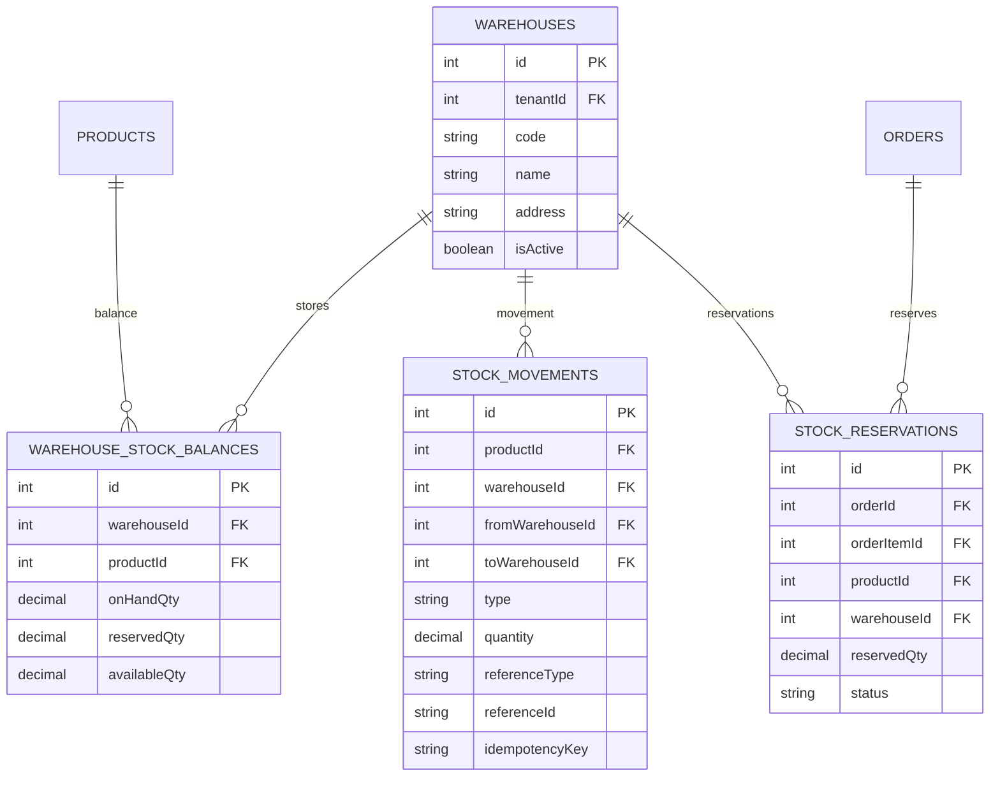

Recommended stock states:

- `onHandQty`: physically in warehouse.
- `reservedQty`: allocated to confirmed orders but not dispatched.
- `availableQty`: `onHandQty - reservedQty`.
- `inTransitQty`: optional projection for transfer shipments.
- `damagedQty`: optional separate balance or movement category.

Multi-warehouse order flow:

1. Order is created.
2. System selects warehouse by route, stock availability, or manual user choice.
3. Order creates `STOCK_RESERVATION`, not immediate stock-out.
4. Dispatch converts reservation into stock issue.
5. Delivery return creates return movement into chosen warehouse.
6. Damage creates damage/loss movement.
7. Settlement posts accounting, not stock reservation logic.

Migration path:

1. Add `warehouses` with a default warehouse.
2. Backfill all current stock into default warehouse balance.
3. Add `warehouseId` nullable to stock movements and orders.
4. Backfill historical movements to default warehouse.
5. Update stock service to use warehouse balances.
6. Make `warehouseId` required for new movements.
7. Add transfer and adjustment flows.

## 17. Multi-Tenant ERP Architecture

Current system has `companies`, but company currently behaves more like product/business grouping than a strict SaaS tenant boundary. A true multi-tenant ERP needs tenant isolation everywhere.

Recommended tenant model:

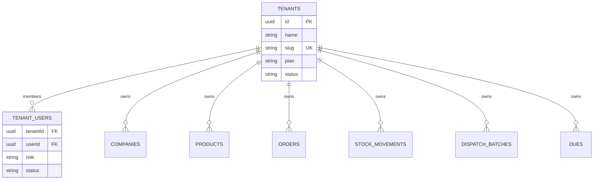

Tenant isolation options:

| Option | Isolation | Cost | Best for |
|---|---|---|---|
| Shared DB, shared schema, `tenantId` everywhere | Medium | Low | Small tenants |
| Shared DB, schema per tenant | High | Medium | Mid-market |
| Database per tenant | Very high | High | Enterprise/compliance |

Recommended starting point:

- Shared database with `tenantId` on every business table.
- Composite unique keys scoped by tenant.
- Request context resolves tenant from user membership.
- Every query is tenant-filtered in a central repository/query helper.
- Add PostgreSQL Row Level Security later for defense in depth.

Required changes:

- Add `tenantId` to companies, routes, shops, products, orders, order items through parent, stock movements, dispatch batches, dues, collections, users membership.
- Replace global `SUPER_ADMIN` with platform admin vs tenant admin distinction.
- Make all unique constraints tenant-scoped, for example `(tenantId, companyId, sku)`.
- Add tenant-aware backups and export/delete workflows.

## 18. Event Sourcing And Outbox Design

Do not jump directly to full event sourcing for everything. Start with an outbox plus immutable domain events, then evolve high-risk domains like stock and accounting.

Recommended event categories:

| Event | Producer | Consumers |
|---|---|---|
| `OrderCreated` | OrdersService | Stock reservation, dashboard projection |
| `StockMovementPosted` | StockService | Stock projection, audit, reports |
| `DispatchBatchCreated` | DeliveryOpsService | Delivery dashboard |
| `BatchDispatched` | DeliveryOpsService | Notifications, delivery app |
| `DeliveryResultSubmitted` | DeliveryOpsService | Settlement draft, dashboard |
| `BatchSettled` | DeliveryOpsService | Accounting ledger, stock return/damage, reports |
| `DueCreated` | DuesService | Due aging report |
| `DueCollectionApproved` | DuesService | Accounting ledger, dashboard |

Core tables:

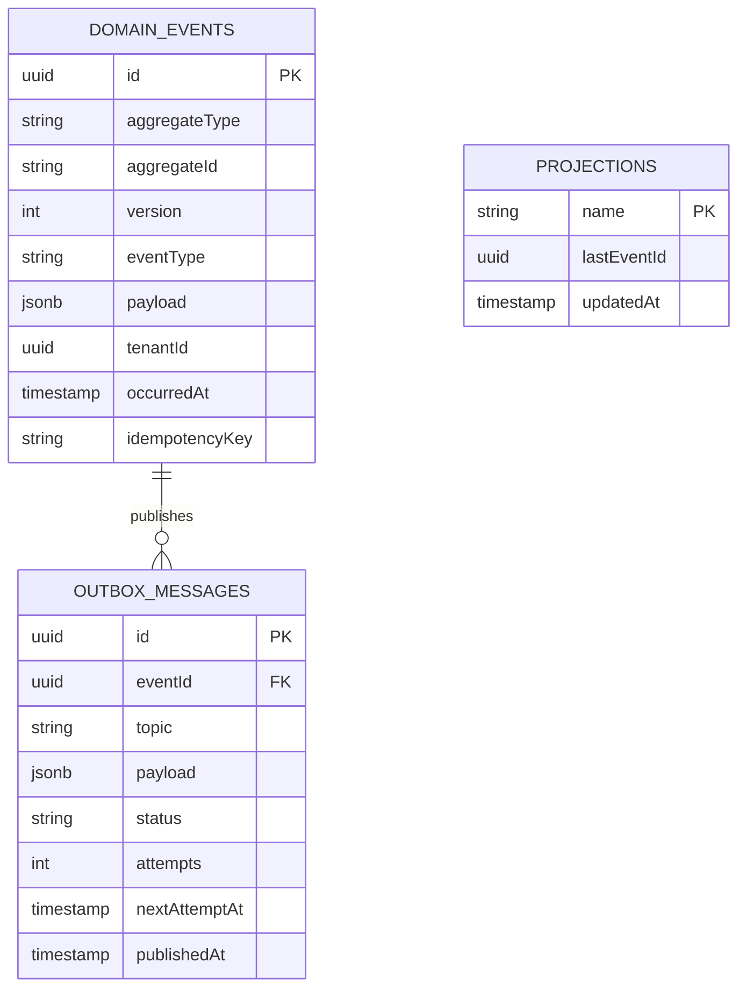

Event write rule:

```text
Business row changes + domain event + outbox message must commit in the same DB transaction.
```

Projection examples:

- `daily_sales_snapshot`
- `stock_balance_projection`
- `due_aging_snapshot`
- `delivery_man_performance_snapshot`
- `tenant_dashboard_snapshot`

Benefits:

- Reliable audit history.
- Replayable reports.
- Idempotent settlement/stock processing.
- Easier microservice migration later.

## 19. Microservice Migration Strategy

Recommended path is modular-monolith first, microservices later.

Phase 1: Stabilize modular monolith

- Fix transactions, validation, auth gaps, and data constraints.
- Add outbox events.
- Add accounting ledger and stock ledger rules.
- Add pagination and indexes.
- Add observability.

Phase 2: Extract read-heavy services

- Reporting service reads projections/snapshots.
- Dashboard service reads cached projections.
- Export service handles long-running report generation.

Phase 3: Extract domain services

```mermaid
flowchart LR
  BFF[ERP API/BFF] --> Auth[Auth/User Service]
  BFF --> Catalog[Company/Product/Route/Shop Service]
  BFF --> OrderSvc[Order Service]
  BFF --> Inventory[Inventory Service]
  BFF --> Delivery[Delivery/Dispatch Service]
  BFF --> Accounting[Accounting/Dues Service]
  BFF --> Reporting[Reporting Service]

  OrderSvc --> Bus[Event Bus]
  Inventory --> Bus
  Delivery --> Bus
  Accounting --> Bus
  Bus --> Reporting
  Bus --> DashboardProjections[Dashboard projections]
```

Service boundaries:

| Service | Owns | Must not directly write |
|---|---|---|
| Auth/User | users, memberships, roles | orders/stock/accounting |
| Catalog | companies, products, routes, shops | stock balances |
| Order | orders, order items | stock movements directly after extraction |
| Inventory | stock movements, balances, reservations | order totals/accounting |
| Delivery | dispatch batches, delivery results | accounting ledger |
| Accounting | dues, collections, ledger, settlement postings | product stock |
| Reporting | projections/snapshots | operational source tables |

Migration rules:

- Split only after the database model is stable.
- Use events, not cross-service DB writes.
- Keep IDs globally unique or tenant-scoped.
- Make every command idempotent.
- Start with separate deployable services sharing the same DB only temporarily; then split schemas/databases.

## 20. Performance Benchmarking Plan

Benchmark goals:

| Area | Target p95 | Notes |
|---|---:|---|
| Login/profile | < 300 ms | No heavy joins |
| Product/stock list | < 500 ms | Paginated |
| Order create | < 800 ms | Includes stock lock/movements |
| Order list | < 700 ms | Paginated, filtered |
| Dispatch batch create | < 1.5 s | 50-100 orders max per batch |
| Delivery result submit | < 800 ms | Per order |
| Settlement | < 2 s | For typical batch; async for huge batch |
| Dashboard | < 700 ms | With snapshots/cache |
| Reports | < 2 s | Date range limited |

Test data volumes:

- Small: 1k orders, 100 products, 20 routes.
- Medium: 100k orders, 2k products, 300 routes, 5k shops.
- Large: 1M orders, 20k products, 50k shops, 5M stock movements.

Benchmark scenarios:

- 20 concurrent SR users creating orders.
- 5 admins creating dispatch batches.
- 50 delivery men submitting delivery results.
- 5 admins settling batches.
- 100 dashboard refreshes/minute.
- Stock summary and history under active order creation.
- Due collection approval under active collection requests.

Suggested tooling:

- `autocannon` for focused HTTP endpoint load.
- `k6` for multi-step user journeys.
- `pg_stat_statements` for slow SQL.
- `EXPLAIN (ANALYZE, BUFFERS)` for query plans.
- Node `clinic`/CPU profiler for local backend profiling.

Example endpoint benchmark:

```bash
autocannon -c 25 -d 60 -H "Authorization: Bearer TOKEN" "https://api.example.com/api/orders"
```

Example journey benchmark:

```text
login -> fetch products/stock -> create order -> create batch -> dispatch -> delivery result -> settlement
```

## 21. Query Optimization Analysis

Current high-cost patterns:

| Area | Current pattern | Risk | Recommended change |
|---|---|---|---|
| Dashboard | Loads all orders with items/products, then filters in JS | Memory and CPU blowup | SQL aggregates or dashboard snapshots |
| Order list | Joins company/route/shop/items/product and returns all rows | Large response and duplicate join work | Pagination, selective fields, separate details endpoint |
| Stock summary | Loads all products and all settled batches/items | Slow with many products/batches | SQL aggregate queries and snapshots |
| Stock history | Unpaginated movements with joins and `ILIKE` | Slow history page | Pagination, date range, indexes |
| Delivery batch list | Multi-join batch/order/shop/items query | Join explosion | List endpoint should return summary only; details endpoint loads deep graph |
| Active batch check | Loads all active batches and relations | Slow and race-prone | Query only active order IDs or use DB constraint |
| Free quantity report | Loads all matching items and groups in Node | Memory heavy | SQL `GROUP BY`, paginated detail rows |
| Due list | Unpaginated joins | Slow as dues grow | Pagination and status/date filters |
| Search | `%term%` with `ILIKE` | B-tree indexes cannot help much | `pg_trgm` GIN indexes or normalized search columns |

Priority rewrites:

1. Add pagination to `orders.findAll`, `getDispatchBatches`, `stock.getHistory`, `dues.findAll`, and free quantity details.
2. Replace dashboard order loading with aggregate SQL.
3. Split dispatch batch list into summary vs detail endpoints.
4. Replace stock summary all-time settled batch scan with stored daily/product aggregates.
5. Add report date range requirements.

Dashboard aggregate direction:

```sql
SELECT
  COUNT(*) FILTER (WHERE status <> 'CANCELLED') AS total_orders,
  SUM("grandTotal") FILTER (WHERE status <> 'CANCELLED') AS total_order_value,
  SUM("actualSoldAmount") FILTER (WHERE status = 'SETTLED') AS settled_sales,
  SUM("dueAmount") FILTER (WHERE status IN ('PARTIAL_DUE', 'SETTLED')) AS order_due
FROM orders
WHERE ($1::int IS NULL OR "companyId" = $1);
```

## 22. Index Optimization Map

Use `CREATE INDEX CONCURRENTLY` in production where possible.

Core indexes:

```sql
-- Orders: list, dashboard, dispatch eligibility
CREATE INDEX CONCURRENTLY IF NOT EXISTS idx_orders_status_date
ON orders (status, "orderDate" DESC, "createdAt" DESC);

CREATE INDEX CONCURRENTLY IF NOT EXISTS idx_orders_company_status_date
ON orders ("companyId", status, "orderDate" DESC);

CREATE INDEX CONCURRENTLY IF NOT EXISTS idx_orders_route_status_date
ON orders ("routeId", status, "orderDate" DESC);

CREATE INDEX CONCURRENTLY IF NOT EXISTS idx_orders_created_by_status_date
ON orders ("createdById", status, "orderDate" DESC);

CREATE INDEX CONCURRENTLY IF NOT EXISTS idx_orders_assigned_delivery_status
ON orders ("assignedDeliveryManId", status);

CREATE INDEX CONCURRENTLY IF NOT EXISTS idx_orders_shop
ON orders ("shopId");
```

```sql
-- Order items: product reports and order detail
CREATE INDEX CONCURRENTLY IF NOT EXISTS idx_order_items_order
ON order_items ("orderId");

CREATE INDEX CONCURRENTLY IF NOT EXISTS idx_order_items_product
ON order_items ("productId");

CREATE INDEX CONCURRENTLY IF NOT EXISTS idx_order_items_free_qty
ON order_items ("freeQuantity")
WHERE "freeQuantity" > 0;
```

```sql
-- Dispatch batches
CREATE INDEX CONCURRENTLY IF NOT EXISTS idx_batches_status_date
ON dispatch_batches (status, "dispatchDate" DESC, "createdAt" DESC);

CREATE INDEX CONCURRENTLY IF NOT EXISTS idx_batches_route_status_date
ON dispatch_batches ("routeId", status, "dispatchDate" DESC);

CREATE INDEX CONCURRENTLY IF NOT EXISTS idx_batches_company_status_date
ON dispatch_batches ("companyId", status, "dispatchDate" DESC);

CREATE INDEX CONCURRENTLY IF NOT EXISTS idx_batches_assigned_delivery_status
ON dispatch_batches ("assignedDeliveryManId", status);
```

```sql
-- Dispatch batch orders
CREATE INDEX CONCURRENTLY IF NOT EXISTS idx_batch_orders_batch
ON dispatch_batch_orders ("batchId");

CREATE INDEX CONCURRENTLY IF NOT EXISTS idx_batch_orders_order
ON dispatch_batch_orders ("orderId");

CREATE INDEX CONCURRENTLY IF NOT EXISTS idx_batch_orders_delivery_status
ON dispatch_batch_orders ("deliveryStatus");

-- Prevent one order from being in two unsettled active batch-order rows.
-- Requires a denormalized active flag or status on dispatch_batch_orders, or a trigger-backed design.
-- Alternative: enforce in service with order row lock.
```

```sql
-- Stock
CREATE INDEX CONCURRENTLY IF NOT EXISTS idx_stock_movements_product_created
ON stock_movements ("productId", "createdAt" DESC);

CREATE INDEX CONCURRENTLY IF NOT EXISTS idx_stock_movements_company_created
ON stock_movements ("companyId", "createdAt" DESC);

CREATE INDEX CONCURRENTLY IF NOT EXISTS idx_stock_movements_type_created
ON stock_movements (type, "createdAt" DESC);

CREATE INDEX CONCURRENTLY IF NOT EXISTS idx_stock_movements_reference
ON stock_movements (reference);

CREATE INDEX CONCURRENTLY IF NOT EXISTS idx_products_company_active_name
ON products ("companyId", "isActive", name);
```

```sql
-- Dues and collections
CREATE INDEX CONCURRENTLY IF NOT EXISTS idx_dues_status_route
ON dues (status, "routeId");

CREATE INDEX CONCURRENTLY IF NOT EXISTS idx_dues_sr_status
ON dues ("srId", status);

CREATE INDEX CONCURRENTLY IF NOT EXISTS idx_dues_shop_status
ON dues ("shopId", status);

CREATE INDEX CONCURRENTLY IF NOT EXISTS idx_due_collections_status_created
ON due_collections (status, "createdAt" DESC);

CREATE INDEX CONCURRENTLY IF NOT EXISTS idx_due_collections_due_status
ON due_collections ("dueId", status);

CREATE INDEX CONCURRENTLY IF NOT EXISTS idx_due_collections_sr_status
ON due_collections ("srId", status);
```

```sql
-- Search acceleration for ILIKE '%term%'
CREATE EXTENSION IF NOT EXISTS pg_trgm;

CREATE INDEX CONCURRENTLY IF NOT EXISTS idx_products_name_trgm
ON products USING gin (name gin_trgm_ops);

CREATE INDEX CONCURRENTLY IF NOT EXISTS idx_products_sku_trgm
ON products USING gin (sku gin_trgm_ops);

CREATE INDEX CONCURRENTLY IF NOT EXISTS idx_shops_name_trgm
ON shops USING gin (name gin_trgm_ops);

CREATE INDEX CONCURRENTLY IF NOT EXISTS idx_shops_phone_trgm
ON shops USING gin (phone gin_trgm_ops);

CREATE INDEX CONCURRENTLY IF NOT EXISTS idx_batches_batch_no_trgm
ON dispatch_batches USING gin ("batchNo" gin_trgm_ops);
```

Important: run `EXPLAIN (ANALYZE, BUFFERS)` before and after each index. Unused indexes slow writes and stock/order writes are business-critical.

## 23. API Response Time Profiling

Add request timing middleware/interceptor:

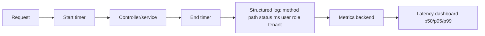

Minimum metrics per endpoint:

- Request count.
- Error count.
- p50/p95/p99 latency.
- Response size.
- DB query count per request.
- Slowest SQL query.
- User role and tenant/company scope.

Endpoints to profile first:

| Endpoint | Why |
|---|---|
| `GET /dashboard/metrics` | Loads many tables and aggregates in Node |
| `GET /orders` | Deep joins and no pagination |
| `POST /orders` | Stock locking and movement writes |
| `GET /delivery-ops/batches` | Deep joins and role filtering |
| `GET /delivery-ops/batches/:id` | Very deep relation graph |
| `POST /delivery-ops/batches/:id/settlement` | Transaction-heavy and stock/due writes |
| `GET /stock/summary` | Reads products plus settled batches |
| `GET /stock/history` | Movement history can grow quickly |
| `GET /reports/free-quantity` | Report loads and groups many rows |
| `GET /dues` | Unpaginated due list |

Recommended logs:

```json
{
  "event": "api_request",
  "method": "GET",
  "path": "/api/orders",
  "status": 200,
  "durationMs": 431,
  "role": "MANAGER",
  "userId": "uuid",
  "queryCount": 12,
  "responseBytes": 185430
}
```

Profiling workflow:

1. Enable request timing logs.
2. Enable TypeORM slow query logging in staging.
3. Run benchmark scenarios.
4. Capture top 10 slow endpoints.
5. For each slow endpoint, capture top SQL with `EXPLAIN (ANALYZE, BUFFERS)`.
6. Fix query shape before adding indexes.
7. Add index only when the query plan proves it helps.
8. Add regression benchmark to CI for critical flows.

## 24. Memory And CPU Bottleneck Analysis

Current likely memory bottlenecks:

- Dashboard loads all orders with `items` and `items.product`.
- Order list loads all orders with all items/products.
- Dispatch batch list joins batches, batch orders, orders, shops, routes, and items.
- Free quantity report loads all matching rows then groups in JavaScript.
- Stock summary loads all products and all settled batch items.
- Large JSON responses are built fully in memory before sending.

Current likely CPU bottlenecks:

- JavaScript reductions over large entity graphs.
- Repeated numeric conversions and date checks in Node.
- `ILIKE '%term%'` scans without trigram indexes.
- TypeORM hydration of large joined graphs.
- Sorting in memory after large fetches, such as dashboard recent orders.

Current likely database bottlenecks:

- Missing composite indexes for status/date/company/route filters.
- Join explosion in list endpoints.
- Product row lock contention on hot products during order creation.
- No read replica or report snapshot layer.
- No query-level timeout or statement timeout visible.

Mitigations:

| Bottleneck | Fix |
|---|---|
| Large entity hydration | Use select projections and raw aggregate queries |
| Unpaginated lists | Add page/limit/cursor pagination |
| Dashboard CPU | Move to SQL aggregates or snapshot table |
| Report CPU | SQL `GROUP BY` plus async export |
| Hot product stock locks | Reservation model, stock by warehouse, shorter transactions |
| Search scans | Trigram indexes or dedicated search table |
| Large response payloads | Summary endpoints plus detail endpoints |
| Serverless cold starts | Long-running backend or warmed/min instances |
| DB connection spikes | Pooler plus strict max connection settings |

Recommended production guardrails:

- API request timeout.
- DB statement timeout.
- Max response size for list endpoints.
- Pagination required by default.
- Rate limiting for dashboard/report endpoints.
- Background job queue for exports and bulk reconciliation.
- Slow query log threshold around 250-500 ms in staging, 500-1000 ms in production.

